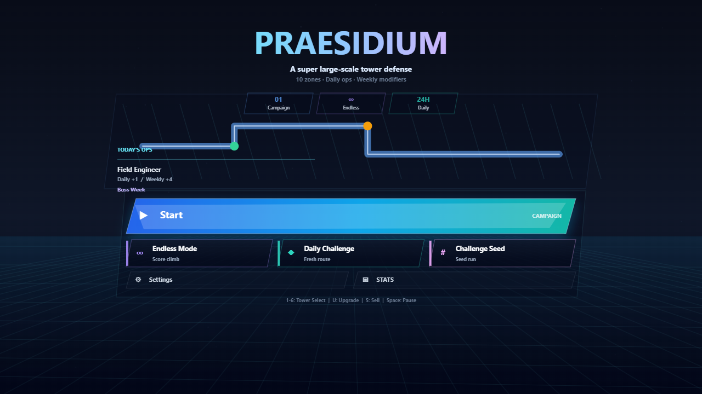
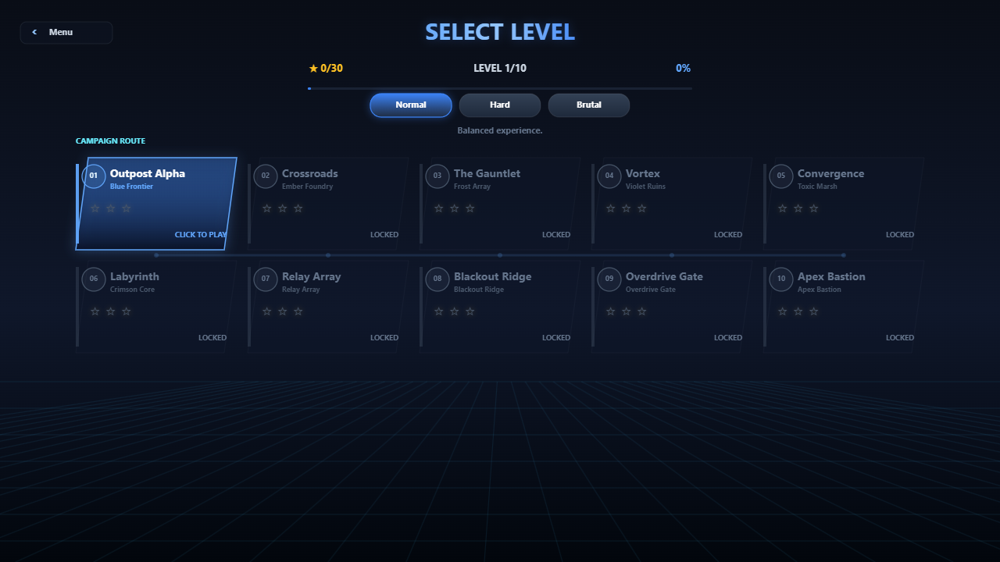
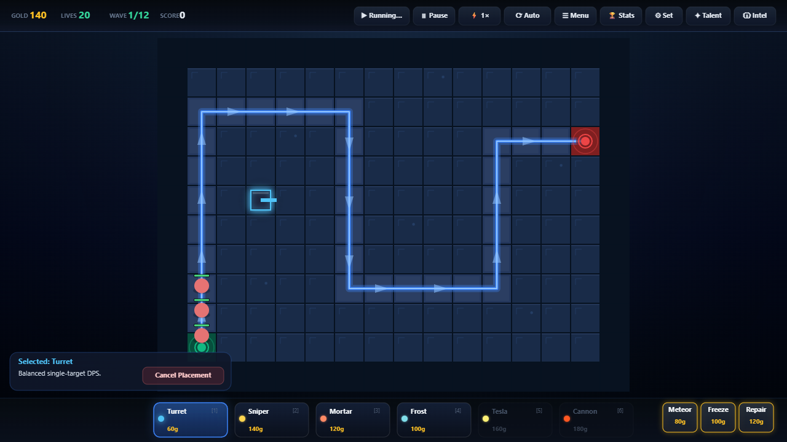
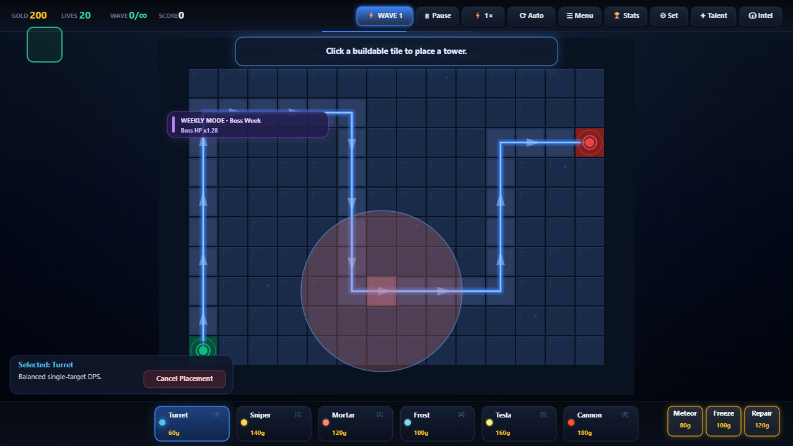
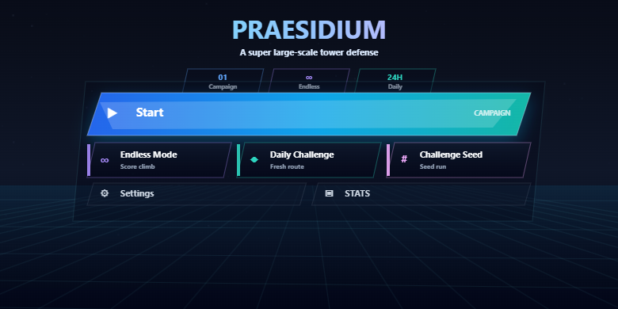

<div align="center">

# 🛡️ Praesidium / 守望

**一款高完成度的科幻塔防网页游戏。**  
建造防线、升级炮塔、释放技能、解锁天赋，在战役、无尽、每日挑战与种子挑战中守住最后阵地。

[](#技术栈)
[](#技术栈)
[](#技术栈)
[](#技术栈)
[](https://lunora-gather.github.io/Praesidium/)

[在线游玩](https://lunora-gather.github.io/Praesidium/) · [核心玩法](#核心玩法) · [本地运行](#本地运行) · [质量验证](#质量验证) · [发布信息](#发布信息)

</div>

---

## 项目简介

**Praesidium** 源自拉丁语，意为“防御 / 守护”。这是一个直接运行在浏览器中的科幻塔防游戏，使用 **TypeScript + HTML5 Canvas + Web Audio API + Vite** 构建。

项目不依赖大型游戏引擎，主要通过代码完成地图、敌人、炮塔、弹幕、粒子、音效、UI 与进度系统。它的目标不是简单复刻塔防，而是做成一个完整的轻量级网页游戏作品：可立即游玩、可长期成长、可重复挑战，也便于继续扩展。

---

## 在线游玩

```text
https://lunora-gather.github.io/Praesidium/
```

如果页面刚部署后仍显示旧版本，可以强制刷新浏览器缓存。

| 系统 | 快捷键 |
| --- | --- |
| Windows / Linux | `Ctrl + F5` |
| macOS | `Command + Shift + R` |

---

## 截图

| Command Deck | Campaign Route |
| --- | --- |
|  |  |

| Battle HUD | Weekly Mode | Mobile Landscape |
| --- | --- | --- |
|  |  |  |

---

## 核心玩法

| 模块 | 内容 |
| --- | --- |
| **战役关卡** | 10 个不同路径布局和独立视觉主题的关卡，逐步提高防守压力。 |
| **炮塔系统** | 6 种炮塔：Turret、Sniper、Mortar、Frost、Tesla、Cannon。 |
| **敌人系统** | 多类型敌人拥有不同速度、生命、奖励和抗性，Boss 波有独立警告反馈。 |
| **升级与出售** | 炮塔支持多级升级，也可以出售回收部分金币。 |
| **目标策略** | 炮塔可切换 first、last、strongest、weakest、closest 等目标策略。 |
| **协同加成** | 相邻炮塔提供伤害和攻速加成，鼓励布局取舍。 |
| **玩家技能** | Meteor、Freeze、Repair 三种主动技能用于爆发、控场和续航。 |
| **天赋成长** | 通过星级获得天赋点，永久强化金币、伤害、射程、攻速、生命和技能冷却。 |
| **成就系统** | 击杀、金币、建塔、升级、技能、通关等长期目标。 |
| **统计面板** | 记录游玩次数、时长、关卡胜率、塔使用情况和无尽模式表现，并可导出本地 playtest 报告。 |
| **排行榜** | 本地离线排行榜与确定性 NPC 分数，用于无服务器的挑战对比。 |

---

## 游戏模式

### Campaign / 战役

从第 1 关开始逐步推进，完成关卡后解锁下一关。每关根据剩余生命计算星级，并将最佳星级和最高分保存到本地。

### Endless / 无尽模式

敌潮不会在固定波数后结束，而是持续增长。无尽模式会记录最高分和最高波次，适合重复挑战。

### Daily Challenge / 每日挑战

基于当天日期生成固定种子。同一天进入挑战的玩家会面对同一套波次节奏，适合每日刷新纪录。

### Challenge Seed / 种子挑战

输入指定十六进制种子，复现同一局无尽挑战。失败后可以复制种子，方便分享给别人挑战同一局。

---

## 操作说明

| 操作 | 输入 |
| --- | --- |
| 选择炮塔 | 点击底部炮塔卡片，或按数字键 `1` - `6` |
| 放置炮塔 | 选择炮塔后点击可建造地块 |
| 选择已有炮塔 | 点击地图上的炮塔 |
| 升级炮塔 | 点击炮塔面板中的 Upgrade，或按 `U` |
| 出售炮塔 | 点击炮塔面板中的 Sell，或按 `S` |
| 切换目标策略 | 选中炮塔后按 `T` |
| 暂停 / 继续 | 空格键，或点击 HUD 按钮 |
| 释放技能 | `Q` / `W` / `E`，然后点击目标位置或等待技能生效 |
| 开始下一波 | 点击 `Send Wave` |
| 加速 | 点击速度按钮切换 `1× / 2× / 3×` |

---

## 系统设计

```text
src/
├── main.ts                 # 游戏入口：装配引擎、状态、UI、输入和渲染循环
├── engine/                 # 通用引擎层
│   ├── GameLoop.ts         # 固定时间步主循环
│   ├── Input.ts            # 鼠标、触摸、键盘统一输入
│   ├── Renderer.ts         # Canvas 绘制、相机、震屏和基础图形封装
│   └── Audio.ts / Music.ts # Web Audio 程序化音效与背景音乐
├── game/                   # 玩法权威状态
│   ├── GameState.ts        # 顶层状态机、经济、生命、波次、技能、存档
│   ├── towers/             # 炮塔定义、实例、升级和目标策略
│   ├── enemies/            # 敌人定义、移动、生命、抗性
│   ├── projectiles/        # 弹幕、追踪、溅射和轨迹
│   ├── systems/            # 战斗系统与移动系统
│   ├── waves/              # 波次生成、无尽模式和种子挑战
│   ├── grid/               # 关卡、路径、地块和寻路
│   ├── spells/             # 玩家主动技能
│   ├── Achievements.ts     # 成就系统
│   └── Talents.ts          # 天赋成长系统
├── ui/                     # Canvas UI 绘制层
│   ├── HUD.ts              # 顶部状态栏、底部商店、快捷按钮
│   ├── WorldRenderer.ts    # 地图、炮塔、敌人、弹幕、范围和特效
│   ├── Screens.ts          # 主菜单、暂停、胜利、失败界面
│   ├── LevelSelect.ts      # 关卡选择与难度选择
│   ├── SettingsScreen.ts   # 设置面板
│   ├── StatsScreen.ts      # 统计与排行榜面板
│   └── TalentPanel.ts      # 天赋升级面板
├── config/                 # 平衡、难度和玩家设置
├── utils/                  # 本地存档、统计、排行榜、随机数、日志与国际化
└── scripts/                # 自测脚本、存档回归和平衡模拟
```

---

## 技术栈

| 分类 | 技术 |
| --- | --- |
| 语言 | TypeScript |
| 构建 | Vite |
| 渲染 | HTML5 Canvas 2D |
| 音频 | Web Audio API |
| 存储 | LocalStorage |
| 测试/验证 | TypeScript typecheck + runtime selftests + balance simulation |
| 部署 | GitHub Actions + GitHub Pages |

---

## 本地运行

```bash
git clone https://github.com/Lunora-Gather/Praesidium.git
cd Praesidium
npm install
npm run dev
```

默认开发地址：

```text
http://localhost:5175
```

生产构建与本地预览：

```bash
npm run build
npm run preview
```

---

## 质量验证

项目提供统一验证入口：

```bash
npm run verify
```

该命令会依次执行：

1. TypeScript 类型检查；
2. 核心玩法自测；
3. 中途存档 / 恢复回归检查；
4. 自动平衡模拟；
5. 生产构建。

也可以单独运行：

```bash
npm run typecheck
npm run selftest
npm run test:save
npm run balance:sim
npm run build
```

### Balance Simulation / 平衡模拟

`npm run balance:sim` 会使用脚本玩家自动运行：

- 10 个战役关卡；
- Normal / Hard / Brutal 三种难度；
- balanced / antiFast / antiBoss 三种建造策略。

它会输出每个关卡和难度下的最佳结果，包括胜负、星级、生命、波次、分数、击杀、建塔、升级和塔使用分布。这个脚本主要用于发现：

- Normal 模式是否存在明显卡关；
- Hard / Brutal 是否出现难度断崖；
- 某些炮塔是否长期没人使用；
- 最近的数值改动是否导致关卡突然不可通。

该模拟不是正式玩家测试的替代品，但它是市场级发布前的回归报警器。

---

## 发布信息

| 文件 | 用途 |
| --- | --- |
| `LICENSE` | MIT 开源许可。 |
| `CHANGELOG.md` | 记录主要新增、修改和修复。 |
| `docs/PRIVACY.md` | 说明游戏只使用浏览器本地存储，不自带远程追踪。 |
| `docs/RELEASE_CHECKLIST.md` | 发布前检查表和当前市场化差距。 |
| `docs/RELEASE_NOTES_v1.0.0.md` | 1.0.0 正式发布说明。 |

---

## 当前优化重点

- 保持 `npm run verify` 与 `npm run release:gate` 作为 1.0.0 后续补丁的发布门禁；
- 持续补充截图/GIF、外部试玩反馈和后续平衡微调记录；
- 做上线后设备回归：桌面、小屏横屏、移动浏览器、缓存刷新。

---

## License

This project is licensed under the MIT License. See the `LICENSE` file for details.
